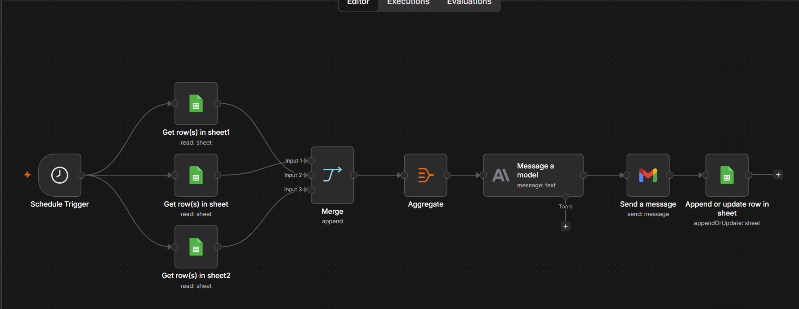

# n8n Restaurant Dashboard Pipeline

An automated daily analytics pipeline for a restaurant. It pulls sales, inventory,
and staff data from Google Sheets, uses Claude (Anthropic) to generate insights,
**emails a daily report to the owner**, and logs the results for tracking.

## Problem
Restaurant data lived in three separate spreadsheets. Reviewing them every day
took time, and trends or issues (low stock, sales drops) were easy to miss.

## Solution
A scheduled n8n workflow that runs automatically and delivers a ready-to-read
report to the inbox, with no manual work.

## How it works
1. **Schedule Trigger** – runs daily at a set time
2. **Google Sheets (x3)** – reads Sales, Inventory, and Staff data
3. **Merge + Aggregate** – combines all rows into a single dataset
4. **Anthropic (Claude)** – analyzes the data and writes a summary with key insights
5. **Gmail** – sends the daily report by email
6. **Google Sheets** – appends/updates a log row so every report is stored

## Tech stack
n8n · Google Sheets API · Anthropic Claude API · Gmail API

## What's new (v2)
- Added automated email delivery via Gmail, so the report reaches the owner
  without opening n8n or the spreadsheets

## How to use
1. Import `workflow.json` into n8n
2. Connect your Google Sheets, Anthropic, and Gmail credentials
3. Replace the Sheet IDs and recipient email with your own
4. Activate the workflow
